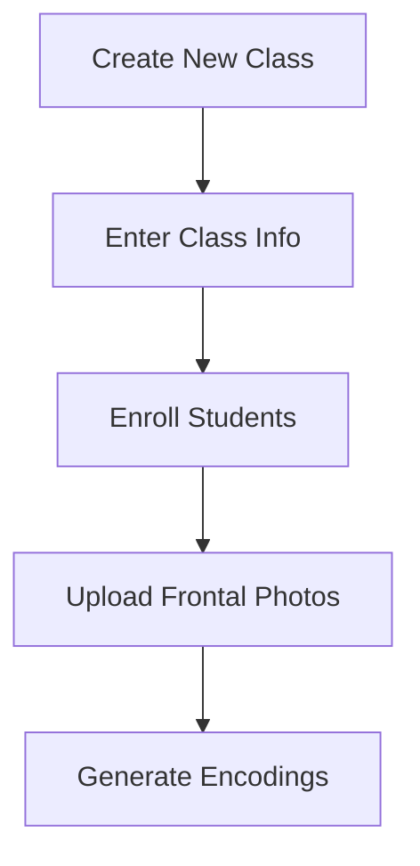
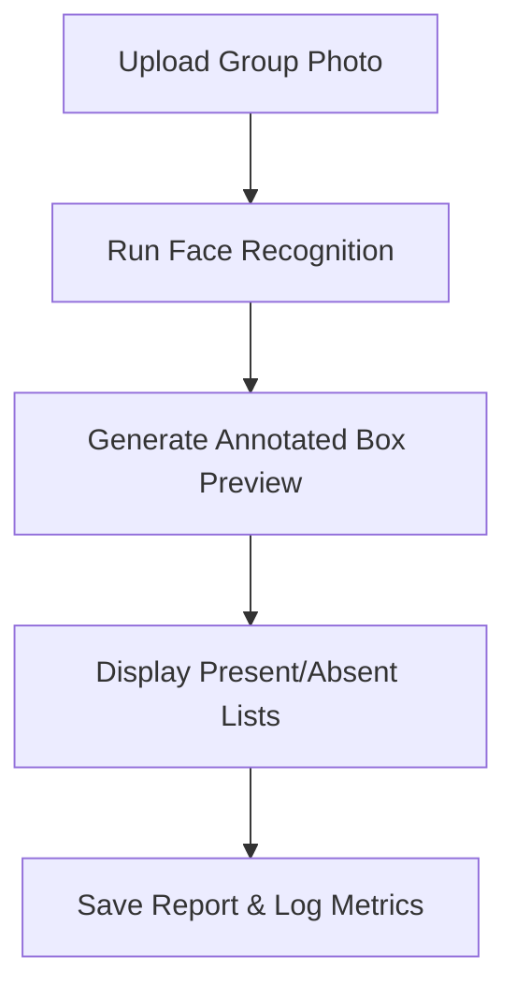

# 🎓 Smart Attendance System

A modern, AI-powered attendance management system that automates student attendance tracking using advanced facial recognition algorithms. Built with Flask, OpenCV, and the `face-recognition` dlib-wrapper, the system offers a beautiful glassmorphism-themed responsive web interface.

---

## 🌟 Features

### 🧠 Facial Recognition Engine
- **Face Detection**: Automatic bounding box location detection using HOG (Histogram of Oriented Gradients) / CNN.
- **128-d Vector Encodings**: Generates unique mathematical representations (vectors) of student faces.
- **Euclidean Distance Comparison**: Employs mathematical distance measurements to compare detected faces against registered students.
- **Confidence Scoring**: Computes a dynamic confidence percentage based on the match distance.
- **Annotated Overlays**: Highlights identified students in green (with names and confidence percentages) and unidentified faces in red.

### 🏫 Student & Class Management
- **Hierarchical Structuring**: Group students by distinct classes/courses.
- **Enrollment Profiles**: Add student details (Student ID, Name, Photo).
- **Single/Multi-Photo Encoding**: Processes student photos to generate persistent JSON-based facial profiles.
- **DRY Data Operations**: Safely delete/modify student profiles and clean up corresponding directory images.

### 📊 Attendance Tracking & Reporting
- **Dynamic Charting**: Rich and visual attendance rate trends plotted dynamically over time using Chart.js.
- **CSV Data Logging**: Automatic saving of attendance reports in CSV formats.
- **Historical Analysis**: Comprehensive view of past attendance sessions with date, time, and record sheets.
- **Absentee Traceability**: Clickable details in student tables to view specific dates a student was marked absent.

---

## 🏗️ System Architecture

### File & Directory Structure
```
attendance-system/
├── app.py                 # Core Flask application with routing, state & business logic
├── config.py              # Centralized environment configuration loader
├── run.py                 # Application bootstrapper and dependency check script
├── attendance_summary.py  # Standalone data aggregation module
├── requirements.txt       # Python package dependencies
├── tailwind.config.js     # CSS compilation config
├── Dockerfile             # Container configuration for quick deployment
├── templates/             # Jinja2 HTML templates
│   ├── base.html          # Global layout (glassmorphism sidebar, navbar, notifications)
│   ├── index.html         # Dashboard displaying dynamic overall statistics
│   ├── add_class.html     # Class setup form & existing class deck
│   ├── class_detail.html  # Student enrollment table and student records
│   ├── attendance_upload.html # Session upload cockpit
│   ├── attendance_result.html # Annotated detection overlays & manual save deck
│   ├── attendance_history.html# CSV history index and spreadsheet viewer
│   └── class_report.html  # Analytical charts & detailed student performances
├── static/                # Static assets directory
│   ├── css/               # Customized styles
│   ├── js/                # Client-side validation scripts
│   ├── images/            # Standard system UI illustrations
│   └── annotated/         # Dynamic cache of processed, box-drawn session images
├── data/                  # Persistent JSON registries representing classes
├── known_faces/           # Student face photos cataloged in subdirectories by class
└── attendance_data/       # Persistent CSV reports and global summary metrics
```

---

## ⚙️ Configuration (`config.py`)

Settings are loaded dynamically from `config.py` into Flask's `app.config` mapping:
* **`SECRET_KEY`**: Security key used for sign-in session management.
* **`UPLOAD_FOLDER`**: Folder location where temporary group images are uploaded (`uploads`).
* **`ALLOWED_EXTENSIONS`**: Permitted input photo formats (`png`, `jpg`, `jpeg`).
* **`MATCH_THRESHOLD`** (Default: `0.6`): Euclidean distance tolerance limit. Lower values indicate stricter matching criteria.
* **`MAX_CONTENT_LENGTH`**: Maximum upload limit (16MB).

---

## 📐 How Facial Recognition Math Works

The system utilizes a 128-dimensional vector space mapping to identify students:

1. **Detection**: Bounding boxes locating the coordinates (Top, Right, Bottom, Left) of all faces in the image are identified.
2. **Feature Extraction**: Landmark analysis generates 128 numerical values (measurements of facial structure, eye-gap, nose-length, etc.) forming a **128-d Vector**.
3. **Euclidean Distance Comparison**:
   The distance $d$ between a query face vector $Q$ and a known student face vector $K$ is computed as:
   $$d(Q, K) = \sqrt{\sum_{i=1}^{128} (Q_i - K_i)^2}$$
4. **Tolerance & Margin Filtering**:
   - To match a student, the distance $d$ must be less than or equal to `MATCH_THRESHOLD` (default `0.6`).
   - **Margin Filter**: If multiple student records are close matches, the system evaluates the gap between the best match distance ($d_1$) and the second-best ($d_2$). The system accepts the match only if:
     $$d_2 - d_1 \ge \text{margin (0.02)}$$
     This prevents false positives in instances where two similar faces are detected.
5. **Confidence Percentage Mapping**:
   Converted using the formula:
   $$\text{Confidence (\%)} = \max\left(0, \left(1 - \frac{d}{0.6}\right) \times 100\right)$$

---

## 🚀 Setup & Installation

### Prerequisites
- Python 3.9 or higher
- C++ compiler tools (Required by `dlib` during source builds if not using pre-compiled wheels)

### Local Setup
1. **Clone the repository**:
   ```bash
   git clone https://github.com/nikhilrawat2005/Smart-Attendance-System.git
   cd Smart-Attendance-System
   ```
2. **Install dependencies**:
   ```bash
   pip install -r requirements.txt
   ```
3. **Run the App**:
   ```bash
   python run.py
   ```
4. **Browse**: Open `http://localhost:5000`

---

## 🐳 Docker Deployment

To spin up the system inside an isolated container:

1. **Build image**:
   ```bash
   docker build -t smart-attendance-system .
   ```
2. **Run container**:
   ```bash
   docker run -p 5000:5000 -v ${PWD}/data:/app/data -v ${PWD}/known_faces:/app/known_faces smart-attendance-system
   ```

---

## 🛠️ System Workflows

### 1. Class & Student Registration


### 2. Take & Log Attendance


---

## 🔌 API Endpoints

### `GET /api/class-overview`
Returns global dashboard overview metrics.
* **Response**:
  ```json
  {
    "total_classes": 3,
    "total_students": 120,
    "attendance_rate": 87.5
  }
  ```

### `GET /api/attendance-stats/<class_name>`
Returns the historical attendance percentages for Chart.js rendering.
* **Response**:
  ```json
  {
    "labels": ["May 20", "May 22", "May 25", "May 29"],
    "datasets": [{
      "label": "Attendance Rate",
      "data": [92.0, 85.5, 88.0, 94.2]
    }]
  }
  ```
